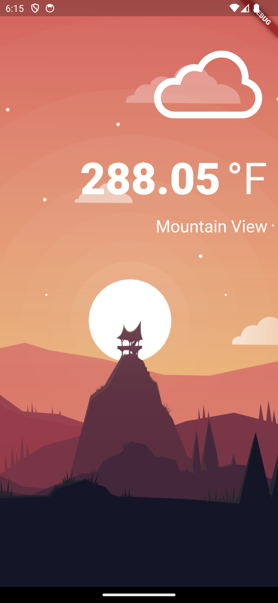
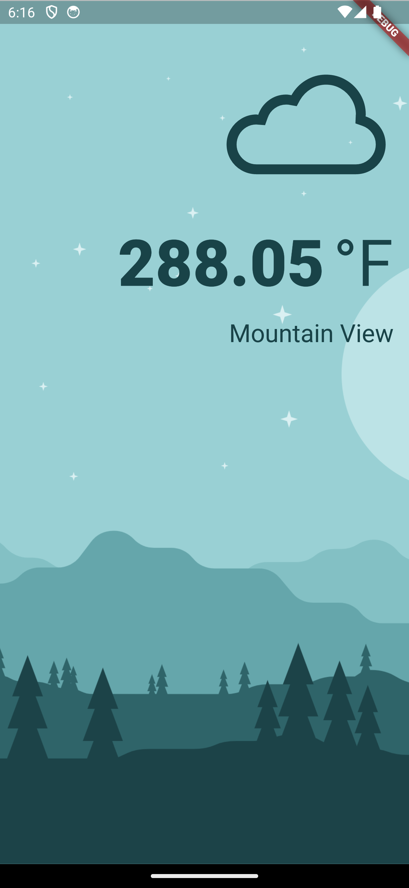

# Weather App

## Overview

The Weather App is a practice project inspired by Angela Yu's course on Flutter development. It is a simple mobile application that fetches real-time weather data based on the user's current location using the OpenWeatherMap API. The app displays weather information, including temperature and location name, on the screen. It also provides a visually appealing user experience by handling dark theme functionality.

## Basic Functionality

The Weather App provides the following basic functionality:

- Fetches real-time weather data based on the user's current location using the [OpenWeatherMap API](https://openweathermap.org/api).
- Displays weather information, including temperature and location name, on the screen.
- Handles dark theme to provide a visually appealing experience in both light and dark modes.
- Includes a liquid pull-to-refresh feature to manually update the weather data.
- Automatically requests permission to access the user's location and handles cases when permission is denied or permanently denied.
- Automatically changes weather icons based on the API response to represent the weather conditions.

## Screenshots

| Light Theme | Dark Theme |
|:------------:|:------------:|
|  |  |

## Getting Started

To run this project locally, follow these steps:

1. Ensure that you have Flutter installed on your local machine. If you don't have it installed, follow the [Flutter installation guide](https://flutter.dev/docs/get-started/install).

2. Clone this repository to your local machine using Git:

   ```bash
   git clone https://github.com/noureen-fatima/Simple-Weather-App.git
   ```

3. Navigate to the project directory:

   ```bash
   cd Simple-Weather-App
   ```

4. Run the following command to get the required dependencies:

   ```bash
   flutter pub get
   ```

5. Connect your Android or iOS device to your development machine or use an emulator/simulator.

6. Finally, run the app:

   ```bash
   flutter run
   ```

## Contributions

This project is a personal practice project and not actively maintained. However, if you find any issues or have suggestions for improvements, feel free to open an issue or create a pull request. Your contributions are appreciated.

## Credits

- This project is part of a practice assignment for an internship, and the design is inspired by Angela Yu's course on Flutter development.
- Used [Stacked](https://pub.dev/packages/stacked) for providing the architecture for the ViewModel implementation.
- The weather data is fetched using the [OpenWeatherMap API](https://openweathermap.org/api) from OpenWeatherMap.

## License

This Weather App project is open-source and available under the [MIT License](LICENSE). Feel free to use, modify, and distribute it as per the terms of the license.

For help getting started with Flutter development, view the
[online documentation](https://docs.flutter.dev/), which offers tutorials,
samples, guidance on mobile development, and a full API reference.
